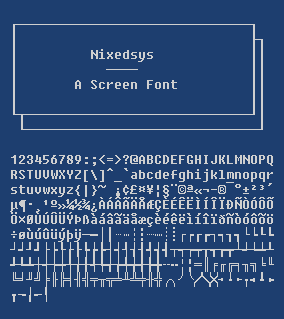

# Nixedsys Font

## Overview

Nixedsys is a 8x15 pixel mostly-sans-serif monospaced bitmap font.  It
exists as a bitmap alternative to the TrueType font Fixedsys
Excelsior.

## Installation

1. Copy or symlink the font to your ~/.fonts directory:
   `cp nixedsys-normal.bdf ~/.fonts`
2. Run `fc-cache -fv` to update your font cache.

## See Also

Nixedsys was inspired by [Fixedsys Excelsior](http://www.fixedsysexcelsior.com/).

Fixedsys Excelsior offers a much larger character set albeit in
TrueType format.  It is a pseudo-bitmap font, with its characters
drawn as scalable vectors.  As of version 3.00 Fixedsys Excelsior has
an increased character cell height of 16 pixels to more easily
accommodate various non-Latin characters.

By contrast, Nixedsys exists as a true bitmap font and retains the
original character cell height of 15 pixels.  The original intent is
to support Western European languages, though non-Latin scripts may be
added in the future.
